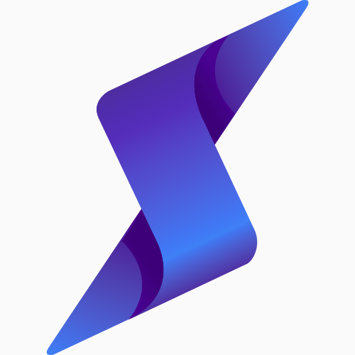

# SoLearn - Decentralized Learning Platform on Solana

<div align="center">
  
  
  [](https://opensource.org/licenses/MIT)
  [](https://www.solearn.co/)
  [](https://x.com/SOLEARN_AI_)
</div>

## 🔑 Overview

SoLearn is a groundbreaking decentralized learning platform built on the Solana blockchain that implements a **"Learn-to-Earn"** model. The platform incentivizes users to learn blockchain and Web3-related knowledge through token rewards, making education both engaging and financially rewarding. Our mission is to lower the barrier to entry for blockchain technology and promote broader Web3 education through economic incentives.

### Key Features

- **Token Rewards**: Earn $LEARN tokens for completing courses and quizzes
- **Achievement NFTs**: Receive unique NFT certificates confirming your skills
- **Interactive Learning**: Immersive experience with video content, quizzes, and coding challenges
- **Personalized Paths**: Customized learning journeys based on your interests and skill level
- **Community Engagement**: Discussion forums, learning guilds, and collaborative projects
- **Decentralized Governance**: Community participation in course review and platform development

## 🚀 Quick Start

### Prerequisites

- Node.js (v18+)
- npm or yarn
- Solana CLI (for blockchain interaction and testing)
- Phantom or other Solana wallets

### Installation

```bash
# Clone the repository
git clone https://github.com/solearn-tech/SoLearn.git
cd SoLearn

# Install dependencies
yarn install

# Frontend
cd apps/web
yarn install

# Backend
cd ../backend
yarn install

# Admin portal
cd ../admin
yarn install

# Set up environment variables
cp .env.example .env
```

### Development

```bash
# Start all services using Turborepo
yarn dev

# Or start individual services
# Frontend
cd apps/web
yarn dev

# Backend
cd ../backend
yarn dev

# Admin
cd ../admin
yarn dev
```

Visit http://localhost:3000 in your browser to view the application.

## 🏗️ Architecture

SoLearn implements a comprehensive full-stack decentralized application architecture with several key components working together:

<div align="center">
<pre>
┌─────────────────────────────────────────────────────────────────┐
│                       CLIENT APPLICATIONS                        │
├───────────────┬───────────────────────────┬───────────────────┬─┘
│ Web Frontend  │      Admin Dashboard      │   Mobile Apps     │
├───────────────┴───────────────────────────┴───────────────────┤
│                     FRONTEND INFRASTRUCTURE                    │
│  ┌─────────────┬──────────────┬───────────────┬────────────┐  │
│  │   React /   │   Wallet     │  State Mgmt   │    UI      │  │
│  │   Next.js   │   Adapter    │   (Context)   │ Components │  │
│  └─────────────┴──────────────┴───────────────┴────────────┘  │
├─────────────────────────────────────────────────────────────┬─┘
│                          API GATEWAY                        │
├─────────────────────────────────────────────────────────────┤
│                     BACKEND INFRASTRUCTURE                   │
│  ┌─────────────┬──────────────┬───────────────┬────────────┐  │
│  │ User Service│  Learning    │  Rewards &    │ Community  │  │
│  │             │  Management  │  Achievements │  Features  │  │
│  └─────────────┴──────────────┴───────────────┴────────────┘  │
├─────────────────────────────────────────────────────────────┬─┘
│                        DATA STORAGE                         │
│  ┌─────────────────────────┐  ┌───────────────────────────┐  │
│  │     MongoDB Database    │  │        IPFS/Arweave       │  │
│  │  (User data, Progress)  │  │      (Course content)     │  │
│  └─────────────────────────┘  └───────────────────────────┘  │
├─────────────────────────────────────────────────────────────┬─┘
│                     BLOCKCHAIN LAYER                        │
│  ┌─────────────┬──────────────┬───────────────┬────────────┐  │
│  │  $LEARN     │ Achievement  │  Governance   │  Smart     │  │
│  │  Token      │    NFTs      │   System      │ Contracts  │  │
│  └─────────────┴──────────────┴───────────────┴────────────┘  │
└─────────────────────────────────────────────────────────────┬─┘
                            SOLANA BLOCKCHAIN                 │
                          └─────────────────────────────────────┘
</pre>
</div>

### Project Structure

The SoLearn project follows a monorepo structure using Turborepo for efficient workflow management:

```
SoLearn/
├── apps/                   # Application packages
│   ├── web/                # Main web frontend (Next.js)
│   ├── backend/            # API server (Express + TypeScript)
│   └── admin/              # Admin dashboard (React)
├── contracts/              # Solana smart contracts
│   ├── token/              # LEARN token contract
│   ├── learning/           # Learning achievements contract
│   └── governance/         # DAO governance contract
├── shared/                 # Shared libraries and utilities
├── scripts/                # Deployment and utility scripts
├── docs/                   # Documentation
└── assets/                 # Static assets and media
```

### Frontend Layer
- **Next.js React Application**
  - Server-side rendering for SEO optimization
  - React Context API for state management
  - Responsive design with TailwindCSS
  - TypeScript for type safety
  - Wallet adapter integration for Solana wallets

### Backend Layer
- **Express API Service**
  - RESTful API with versioning
  - JWT-based authentication with wallet signatures
  - Email verification and password reset functionality
  - MongoDB for flexible data storage
  - Rate limiting and security middleware
  - Modular architecture for maintainability

### Blockchain Layer
- **Solana Smart Contracts**
  - SPL Token implementation for $LEARN tokens
  - Course completion and reward distribution
  - Metaplex integration for NFT achievement issuance
  - On-chain verification of learning achievements
  - Governance mechanisms for platform development
  - Program Derived Addresses (PDAs) for secure data storage

### Storage Layer
- **Hybrid Storage Solution**
  - MongoDB for user data and learning progress
  - IPFS/Arweave for immutable course content
  - Solana blockchain for token transactions and achievements
  - CDN for static assets and media content

## 💻 Key Workflows

SoLearn implements several key workflows that enable seamless interaction between the frontend, backend, and blockchain layers:

### 1. Authentication Flow

Users can authenticate using email/password or connect with their Solana wallet:

1. User initiates authentication on the frontend
2. Backend validates credentials or wallet signature
3. On successful verification, JWT token is issued
4. User session is established with protected routes

### 2. Course Completion Flow

1. User completes a course and submits a quiz/assessment
2. Backend validates submissions and records completion
3. Blockchain contract is called to mint reward tokens
4. Achievement NFT is generated and sent to user's wallet
5. User profile and leaderboard are updated with new progress

### 3. Content Creation Flow

1. Educator creates course content through the admin portal
2. Content is reviewed by governance participants
3. Approved content is stored on IPFS/Arweave with references in MongoDB
4. Content becomes available to learners with specified parameters

## 🧩 Key Components

### User Management

- Registration and authentication
- Profile management
- Wallet connection and verification
- Learning progress tracking
- Achievement showcase

### Learning Platform

- Course catalog and discovery
- Interactive content delivery
- Quizzes and assessments
- Progress tracking
- Reward distribution

### Token System

- LEARN token management
- Token earning mechanisms
- Achievement NFTs
- Governance participation
- Ecosystem incentives

## 🛠️ Development

### Running Tests

```bash
# Run all tests
yarn test

# Run specific tests
yarn test:web      # Frontend tests
yarn test:backend  # Backend tests
yarn test:contracts # Smart contract tests
```

### Contract Deployment

```bash
# Deploy token contract
yarn deploy:token

# Deploy learning contract
yarn deploy:learning

# Deploy full suite
yarn deploy:all
```

## 📝 Contributing

Please read [CONTRIBUTING.md](CONTRIBUTING.md) for details on our code of conduct and the process for submitting pull requests.

## 📄 License

This project is licensed under the MIT License - see the [LICENSE](LICENSE) file for details.

## 🙏 Acknowledgments

- Solana Foundation for blockchain infrastructure
- MetaPlex for NFT standards
- Open source contributors to the Web3 education ecosystem